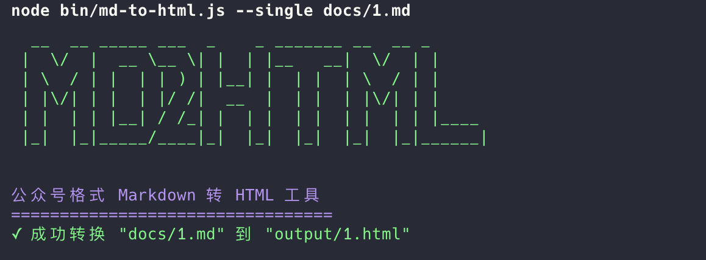

# MD2HTML 工具

一个用于将 Markdown 转换为适合微信公众号的 HTML 格式的命令行工具。

## 功能特点

- 支持单个 Markdown 文件转换
- 支持批量转换整个文件夹
- 多种主题样式选择
- 代码高亮支持
- 目录生成功能

## 安装

### 全局安装

```bash
npm install -g md-to-html
```

### 本地安装

```bash
git clone https://github.com/yourusername/md-to-html.git
cd md-to-html
npm install
```

## 使用方法

### 转换单个文件

```bash
md-to-html --single README.md
```

或者本地开发时：

```bash
node bin/md-to-html.js --single README.md
```

### 批量转换文件夹

```bash
md-to-html --folder ./docs
```

### 指定输出目录

```bash
md-to-html --single README.md --output ./dist
```

### 选择主题

```bash
md-to-html --single README.md --theme github
```

### 显示帮助信息

```bash
md-to-html --help
```

## 支持的主题

1. wechat (默认) - 适合微信公众号
2. github - GitHub 风格主题

## 自定义选项

| 选项 | 说明 | 默认值 |
| ---- | ---- | ------ |
| -s, --single | 转换单个 Markdown 文件 | - |
| -f, --folder | 批量转换文件夹中的所有 Markdown 文件 | - |
| -o, --output | 输出目录 | ./output |
| -t, --theme | 主题样式 | wechat |
| --toc | 添加目录 | false |
| --highlight | 启用代码高亮 | true |
| -v, --version | 显示版本号 | - |
| --help | 显示帮助信息 | - |

## 开发

### 项目结构

```
md-to-html/
├── bin/
│   └── md-to-html.js     # CLI 入口文件
├── src/
│   ├── index.js          # 主程序
│   └── themes.js         # 主题样式定义
├── docs/                 # 示例文档
├── output/               # 转换后的 HTML 文件
├── package.json
└── README.md
```

### 开发说明

1. 克隆仓库并安装依赖：

```bash
git clone https://github.com/yourusername/md-to-html.git
cd md-to-html
npm install
```

2. 本地测试：

```bash
node bin/md-to-html.js --single README.md
```

## 示例代码

```javascript
const md2html = require('md-to-html');
md2html.convertSingle('README.md', { theme: 'wechat' });
```

## 表格示例

| 特性 | 支持情况 |
| ---- | -------- |
| 表格 | ✅ |
| 代码高亮 | ✅ |
| 目录生成 | ✅ |
| 自定义主题 | ⚠️ 计划中 |

## 引用示例

> 这是一个引用示例，适合用于展示重要信息或注意事项。

## 列表示例

### 有序列表

1. 第一步：安装工具
2. 第二步：创建 Markdown 文件
3. 第三步：使用命令转换
4. 第四步：查看生成的 HTML 文件

### 无序列表

- Markdown 是一种轻量级标记语言
- 它允许人们使用易读易写的纯文本格式编写文档
- 通过简单的标记语法，它可以使普通文本内容具有一定的格式

## 图片示例



## 许可证

MIT 